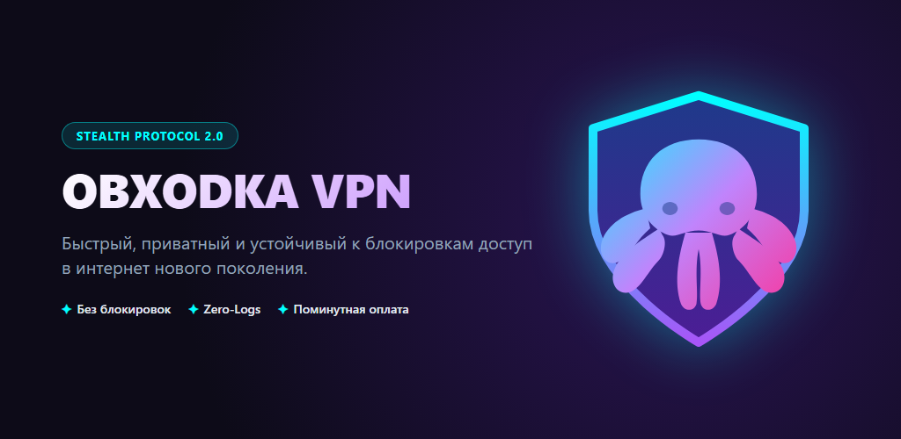
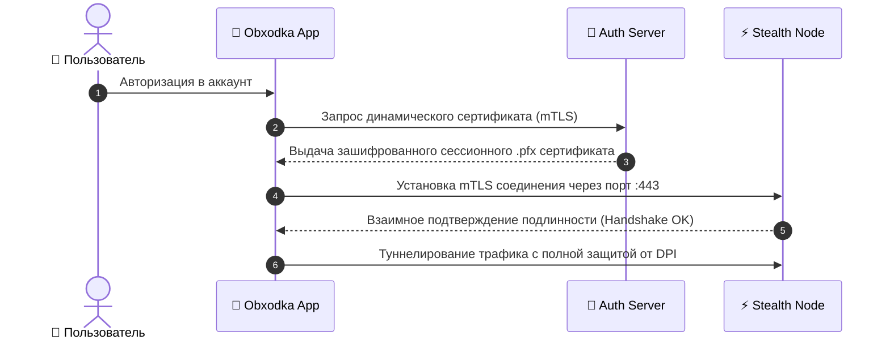
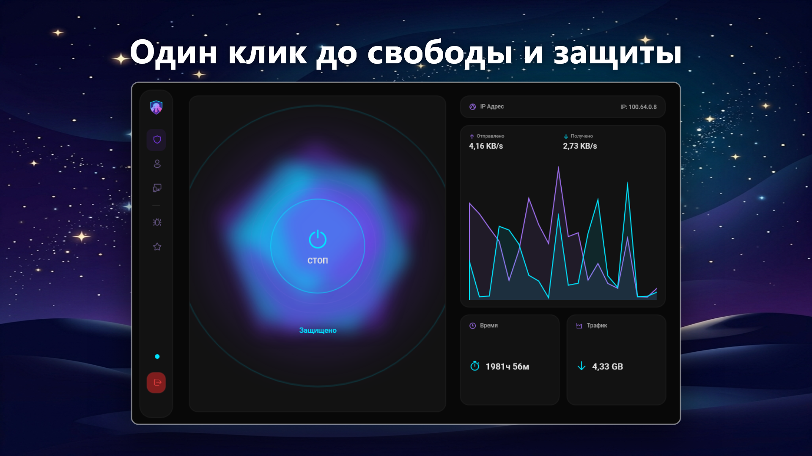
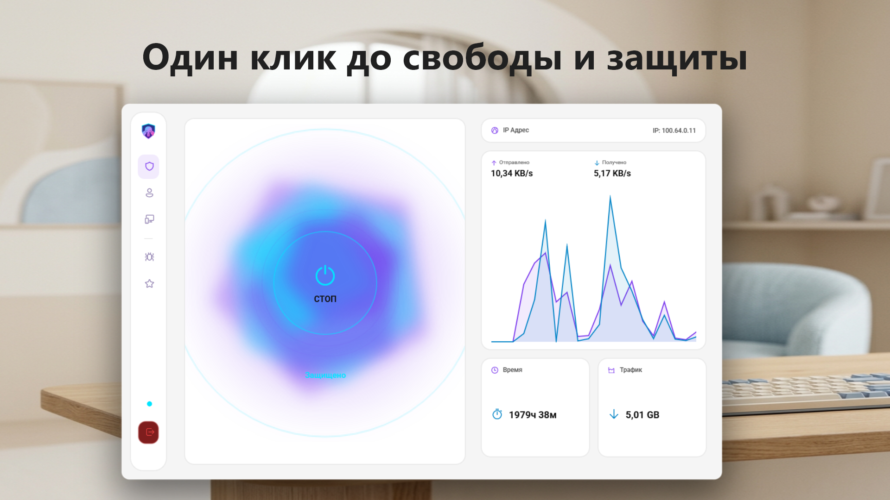
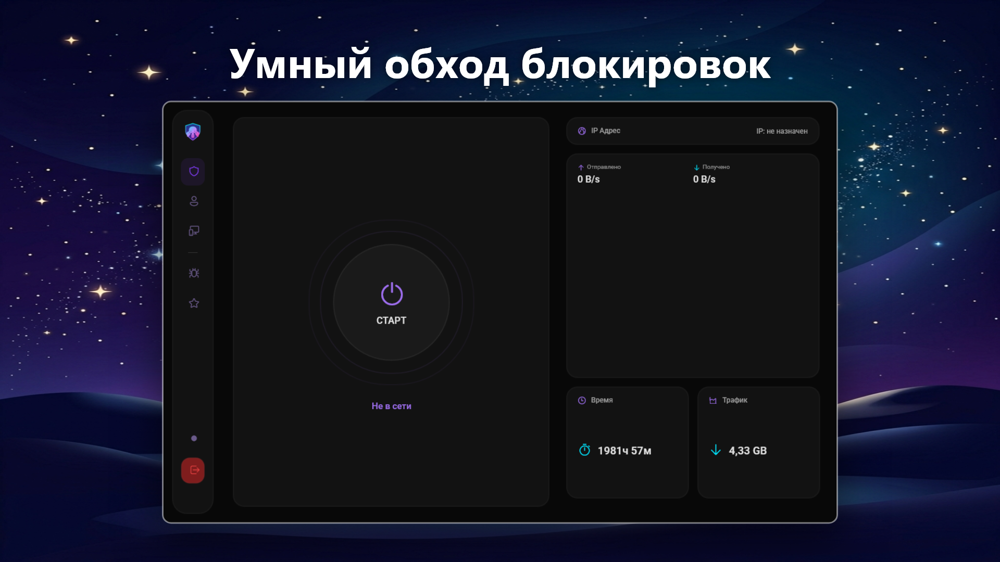
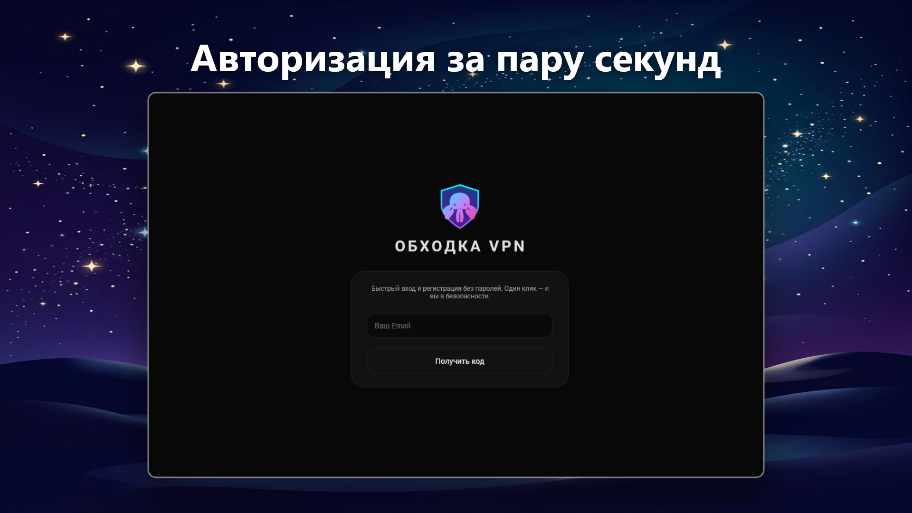

<p align="center">
  
</p>

<p align="center">
  
</p>

<div align="center">

# 🐙 Obxodka VPN Client

### *Продвинутый Stealth VPN-клиент нового поколения для Windows и Android.*
**Абсолютная свобода в сети • Устойчивость к DPI и ТСПУ • Открытый исходный код**

<br/>

[](https://github.com/OctoCore-Dev/obxodka/releases)
[](https://github.com/OctoCore-Dev/obxodka/actions)
[](https://play.google.com/store/apps/details?id=com.octocore.obxodka)
[](https://apps.microsoft.com/store/detail/9NZXP5WR803J)
[](https://obxodka.one/Reviews)
[](https://obxodka.one)

<br/>

[](https://dotnet.microsoft.com/)
[](https://learn.microsoft.com/dotnet/csharp/)
[](https://grpc.io/)
[](https://obxodka.one)
[](https://www.wintun.net/)
[](LICENSE)

</div>

<br/>

<p align="center">
  
</p>

---

## 🚀 Почему Obxodka?

Традиционные протоколы (WireGuard, OpenVPN, IPsec) используют специфические заголовки пакетов и порты UDP, которые мгновенно распознаются и блокируются современными государственными и провайдерскими системами анализа трафика (**DPI / ТСПУ**).

**Obxodka** решает эту проблему принципиально иначе: мы упаковываем весь сетевой трафик в стандартные защищенные **HTTP/2 gRPC потоки через порт 443**. Для внешнего наблюдателя и систем фильтрации ваша активность выглядит как обычный просмотр видео или веб-сёрфинг.

---

## ⚡ Интерактивная архитектура Octopus Engine

Динамическая схема прохождения пакетов через конвейер маскировки и криптографический тоннель:

```mermaid
flowchart LR
    subgraph Client["💻 Клиентское устройство (Windows / Android)"]
        direction TB
        App["🐙 Obxodka Client App (UI / Logic)"]
        Adapter["⚡ Wintun / VpnService (Layer 3)"]
        Stealth["🎭 Stealth Encapsulator (HTTP/2 gRPC)"]
        Crypto["🔐 mTLS Dynamic Crypto (AES-256-GCM)"]
        App --> Adapter --> Stealth --> Crypto
    end

    subgraph ISP["🛡️ Провайдер / ТСПУ (DPI-фильтрация)"]
        direction TB
        DPI{"🕵️ Глубокий анализ пакетов"}
        Pass["✅ 100% Пропуск (Трафик неотличим от обычного HTTPS)"]
        DPI ==> Pass
    end

    subgraph Server["☁️ Серверный кластер Obxodka Core"]
        direction TB
        mTLS_GW["🔑 mTLS Gateway"]
        OctoCore["⚡ Octopus Core Node"]
        CleanNet["🌍 Свободный и чистый Интернет"]
        mTLS_GW --> OctoCore --> CleanNet
    end

    Crypto ==>|Шифрованный поток :443| DPI
    Pass ==>|gRPC Multiplexing| mTLS_GW

    classDef clientStyle fill:#1a1c23,stroke:#00e5ff,stroke-width:2px,color:#fff;
    classDef dpiStyle fill:#2d1b36,stroke:#ff007f,stroke-width:2px,color:#fff;
    classDef serverStyle fill:#13271f,stroke:#00ff88,stroke-width:2px,color:#fff;
    
    class Client clientStyle;
    class ISP dpiStyle;
    class Server serverStyle;
```



---

## 🔐 Протокол аутентификации mTLS Zero-Trust

Никаких статических паролей и общих ключей: каждое устройство проходит динамическую верификацию сертификата:



---

## 📊 Сравнение технологий и протоколов

| Протокол / Технология | Устойчивость к DPI / ТСПУ | Скорость и задержка | Шифрование сессии | Мультиплексирование | Защита от блокировок |
| :--- | :---: | :---: | :---: | :---: | :---: |
| 🐙 **Obxodka (Octopus Engine)** | 🟢 **100% (Не детектируется)** | ⚡ **< 1ms задержка (Wintun)** | 🔒 **mTLS + AES-256-GCM** | 🚀 **HTTP/2 gRPC Streams** | 🛡️ **Максимальная** |
| 🛡️ **WireGuard** | 🔴 **0% (Блокируется по UDP)** | ⚡ **Высокая** | 🔒 ChaCha20-Poly1305 | ❌ Нет | ❌ Блокируется |
| 🔒 **OpenVPN** | 🔴 **10% (Легко детектируется)** | 🐢 **Средняя/Низкая (TAP)** | 🔒 TLS / AES-CBC | ❌ Нет | ❌ Блокируется |
| 👥 **Shadowsocks / VLESS** | 🟡 **60% (Частично блокируется)** | ⚡ **Высокая** | 🔒 AEAD / TLS | ⚠️ Ограничено | ⚠️ Частичная |

---

## 🎨 Галерея интерфейса

<p align="center">
  
  
</p>
<p align="center">
  
  
</p>

---

## 🗺️ Дорожная карта развития (Roadmap 2026)

- [x] 🚀 **Релиз клиента для Android** в [Google Play Store](https://play.google.com/store/apps/details?id=com.octocore.obxodka)
- [x] 🪟 **Релиз клиента для Windows 10/11** в [Microsoft Store](https://apps.microsoft.com/store/detail/9NZXP5WR803J)
- [x] ⚡ **Движок Octopus:** Wintun Layer 3 + Stealth HTTP/2 gRPC
- [x] 🔄 **Автоматическая синхронизация отзывов:** Google Play + Microsoft Store на сайте [obxodka.one/Reviews](https://obxodka.one/Reviews)
- [x] 🛡️ **CI/CD Авто-деплой:** непрерывная сборка и публикация в магазины через GitHub Actions
- [ ] 🍎 **Разработка клиентов под iOS и macOS**
- [ ] 🌐 **Режим Mesh-Routing и децентрализованные релейные ноды**
- [ ] 🛑 **Встроенный AdBlock & Anti-Phishing фильтр на уровне DNS**

---

## ❓ Часто задаваемые вопросы (FAQ)

<details>
<summary><b>🔍 Почему Obxodka не блокируется, когда блокируют другие VPN?</b></summary>
<br>

Большинство обычных VPN используют протоколы с фиксированными сигнатурами (WireGuard handshake, OpenVPN TLS handshake). Системы DPI легко видят такие пакеты и сбрасывают соединение. **Obxodka** инкапсулирует трафик в стандартные gRPC-потоки поверх TLS 1.3 на 443 порту — для любого провайдера это выглядит как обычный защищенный просмотр веб-сайтов крупных IT-корпораций.
</details>

<details>
<summary><b>🛡️ Ведёт ли Obxodka логи посещений (Logs)?</b></summary>
<br>

**Категорически нет.** Вся архитектура построена по принципу Zero-Log. Серверы не хранят историю посещенных сайтов, IP-адреса назначения или DNS-запросы. Трафик проходит через оперативную память в зашифрованном виде и мгновенно уничтожается.
</details>

<details>
<summary><b>💻 Как собрать проект из исходников самостоятельно?</b></summary>
<br>

```bash
# 1. Клонирование репозитория
git clone https://github.com/OctoCore-Dev/obxodka.git
cd obxodka

# 2. Установка рабочих нагрузок .NET MAUI
dotnet workload install maui-windows maui-android

# 3. Сборка клиента под Windows
dotnet build obxodka.csproj -f net10.0-windows10.0.19041.0 -c Release

# 4. Запуск модульных тестов
dotnet test tests/obxodka.Tests/obxodka.Tests.csproj
```
</details>

---

## 🤝 Сообщество и контакты

* 🌐 **Официальный сайт:** [obxodka.one](https://obxodka.one)
* 💬 **Форум и обсуждения:** [GitHub Discussions](https://github.com/OctoCore-Dev/obxodka/discussions)
* 🐛 **Сообщить об ошибке:** [GitHub Issues](https://github.com/OctoCore-Dev/obxodka/issues)
* 📧 **Контакты и поддержка:** [contact@octocore.dev](mailto:contact@octocore.dev)
* 📜 **Кодекс поведения:** [CODE_OF_CONDUCT.md](CODE_OF_CONDUCT.md)
* 🔒 **Политика безопасности:** [SECURITY.md](SECURITY.md)

---

<p align="center">
  <sub>Разработано с ❤️ командой <a href="https://github.com/OctoCore-Dev">OctoCore</a>. Лицензия <a href="LICENSE">MIT</a>.</sub>
</p>
