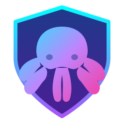

<div>
  

  # Obxodka VPN Client

  **Продвинутый Stealth VPN Клиент нового поколения для Windows и Android.**<br>
  *Абсолютная свобода. Полная анонимность. Открытый исходный код.*

  <br>

  <p>
    <a href="https://obxodka.one/"></a>
    <a href="https://apps.microsoft.com/store/detail/9NZXP5WR803J"></a>
    <a href="https://obxodka.one/Reviews/Index"></a>
  </p>

  <p>
    
    
    
    
  </p>
</div>

<p align="center"></p>

## 🎨 Галерея (Интерфейс)

Мы гордимся не только технологиями, но и красивым, продуманным интерфейсом. Приложение поддерживает Темную и Светлую темы, органично вписываясь в вашу систему.

<p align="center">
  
  
</p>
<p align="center">
  
  
</p>

<p align="center"></p>

> [!TIP]
> **ОТКРЫТЫЙ ИСХОДНЫЙ КОД И ПОЛНАЯ ПРОЗРАЧНОСТЬ**
> Мы верим, что безопасность не должна быть "черным ящиком". Весь код нашего клиента полностью открыт. **Вы можете смело клонировать репозиторий, скомпилировать приложение самостоятельно и пользоваться им!** 

## 🛡️ Зачем мы открыли исходный код?

Доверие — это фундамент любого честного VPN-сервиса. Поскольку клиент Obxodka для Windows требует прав Администратора для управления таблицами маршрутизации и установки виртуальных сетевых адаптеров, мы считаем, что наши пользователи заслуживают **100% прозрачности**.

Мы даем возможность любому желающему (и ИБ-специалистам) лично убедиться, что:
- 🕵️‍♂️ В приложение **не встроены** средства телеметрии или шпионское ПО.
- 🦠 В фоне **не выполняются** скрытые вредоносные процессы (майнеры, ботнеты).
- ⚙️ Повышенные привилегии используются **исключительно** для работы VPN (управление драйвером Wintun).
- 🔐 Приложение максимально безопасно хранит ваши токены сессии (через зашифрованный аппаратный Keystore / DPAPI).

<p align="center"></p>

<details>
<summary><b>🚀 Инструкция: Как скомпилировать и пользоваться самому? (Нажмите, чтобы развернуть)</b></summary>
<br>

Мы приветствуем разработчиков и энтузиастов! Если вы не хотите скачивать готовый билд, вы можете собрать приложение своими руками:

1. **Клонируйте репозиторий:**
   ```bash
   git clone https://github.com/irovbyte/obxodka.git
   cd obxodka
   ```
2. Откройте `obxodka.sln` в **Visual Studio 2022** (необходима нагрузка *.NET Multi-platform App UI development*).
3. Выберите платформу сборки: `Windows Machine` или `Android Emulator / Device`.
4. Нажмите **Run** (`F5`).

🎉 **Готово!** Скомпилированное вами приложение будет работать **абсолютно так же**, как и наше официальное. Оно автоматически подключится к нашему боевому защищенному бэкенду. Вы сможете авторизоваться, оплатить подписку и пользоваться быстрыми серверами через клиент, который вы собрали лично!

> [!NOTE]
> **Архитектура Zero-Trust:** Клиент — это лишь "интерфейс". Вся бизнес-логика (биллинг, подсчет трафика) и генерация уникальных криптографических mTLS-сертификатов надежно спрятаны на нашем закрытом сервере. Изменение кода клиента **не позволит** обойти проверку подписки или лимиты скорости. Сервер не доверяет клиенту и строго контролирует каждый байт!

</details>

<p align="center"></p>

## 🐙 Движок Octopus (Инновационная архитектура)

Клиент Obxodka работает на базе нашего проприетарного **Движка Octopus**. В отличие от традиционных и устаревших VPN-приложений (OpenVPN, WireGuard), которые легко детектируются и блокируются системами глубокого анализа пакетов (DPI / ТСПУ), Octopus Engine инкапсулирует трафик с феноменальной скрытностью.

| Технология | Описание |
| :--- | :--- |
| **Виртуальный адаптер** | Интеграция с невероятно быстрым и легковесным драйвером [Wintun](https://www.wintun.net/) (Layer 3). |
| **Stealth-инкапсуляция** | IP-пакеты упаковываются внутрь стандартных HTTP/2 gRPC потоков. Для вашего провайдера трафик выглядит как обычный просмотр видео или загрузка веб-страницы. Никакого подозрительного UDP! |
| **mTLS Аутентификация** | Никаких общих паролей. Бэкенд генерирует динамический `.pfx` сертификат для вашей сессии. Обоюдоострое шифрование клиента и сервера. |
| **Криптография** | Промышленный стандарт: **TLS 1.3** и **AES-256-GCM**. |
| **Domain Fronting** | Умная подмена SNI для обхода самых агрессивных фаерволов. |

<p align="center"></p>

## 🤝 Присоединяйтесь к комьюнити! (Contributing)

Obxodka — это живой продукт, который создается для людей. Нам очень важен фидбек комьюнити, и вы можете стать соавтором проекта:

- 🐛 **Нашли баг или ошибку в коде?** 
  Пожалуйста, опишите проблему в нашем официальном [Баг-трекере](https://obxodka.one/BugTracker/Index). Мы оперативно всё чиним!
- 💡 **Есть идея по улучшению VPN?**
  Создавайте Issue с пометкой `enhancement`. Предлагайте новый дизайн, крутые фичи или алгоритмы оптимизации.
- 💻 **Хотите написать код сами?**
  Делайте форк (Fork), вносите свои гениальные правки и отправляйте нам **Pull Request**. Лучшие решения мы с гордостью включим в официальный релиз!

> [!WARNING]  
> Если вы ИБ-исследователь (White Hat) и нашли **критическую уязвимость**, пожалуйста, соблюдайте этику и **НЕ публикуйте ее открыто**. Напишите нам напрямую, чтобы мы экстренно защитили наших пользователей:
> 📧 **Email:** [noreply.obxodkavpn@gmail.com](mailto:noreply.obxodkavpn@gmail.com)

<p align="center"></p>

## 💬 Отзывы пользователей

Не верите нам на слово? Почитайте, что пишут реальные пользователи о нашем сервисе! 
👉 **[Читать отзывы на сайте Obxodka](https://obxodka.one/Reviews/Index)**

<br>

<div align="center">
  
  <p>Сделано с ❤️ <b>irovbyte</b></p>
  <p>&copy; 2026 irovbyte. All Rights Reserved.</p>
</div>
