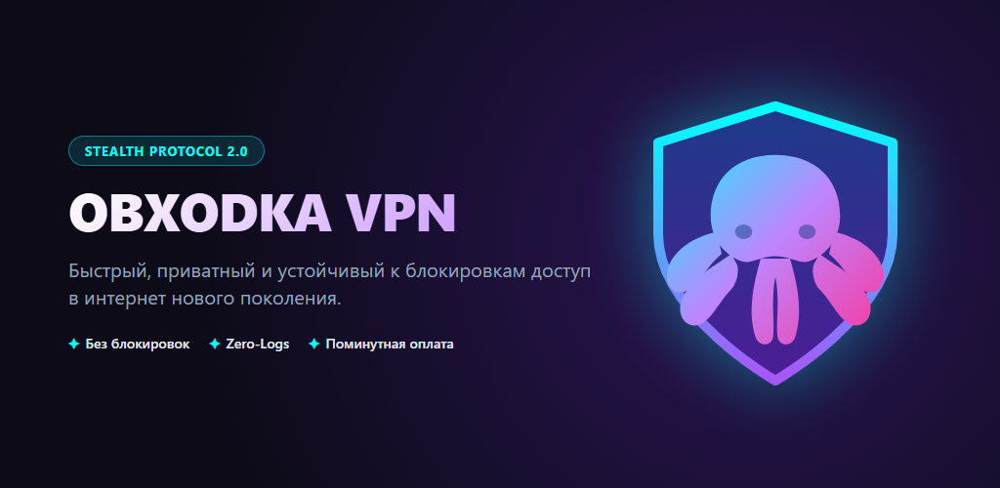
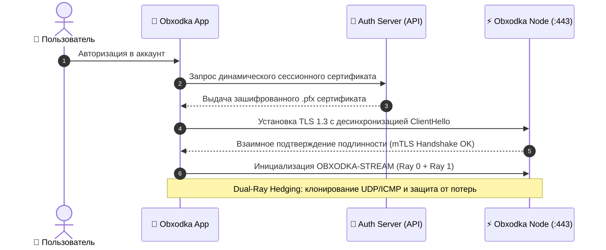
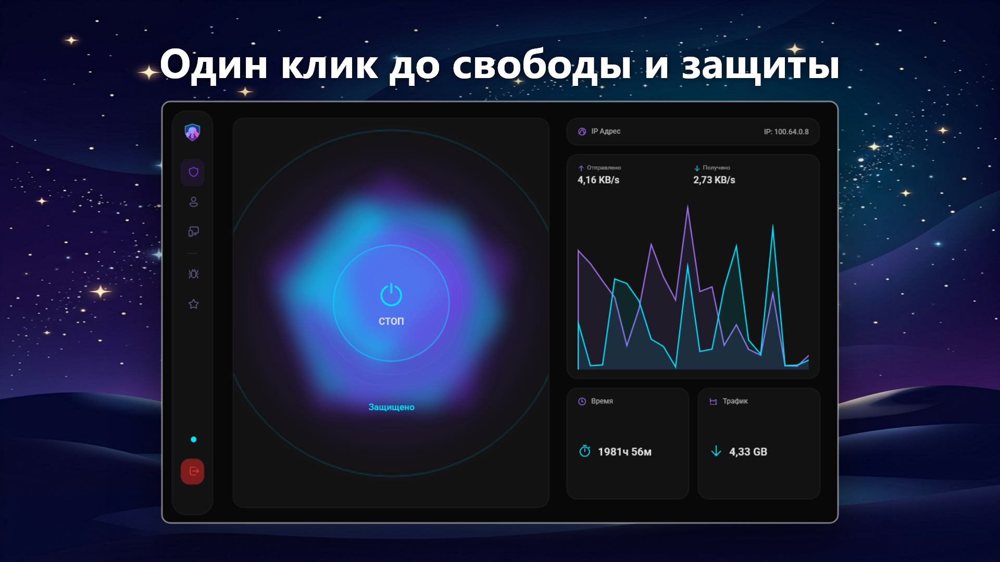
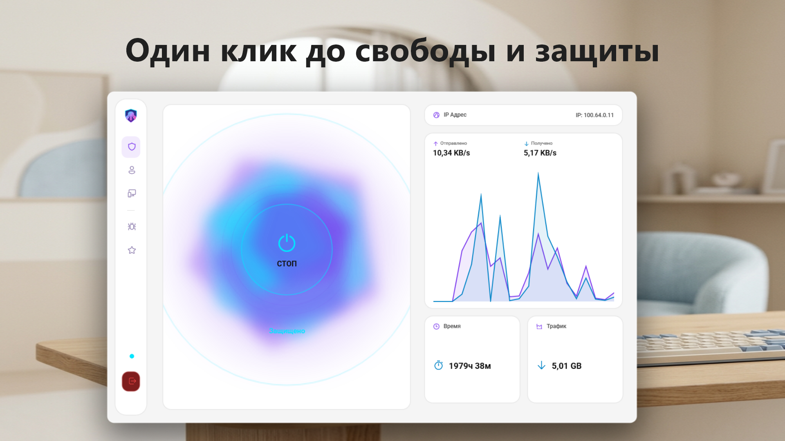
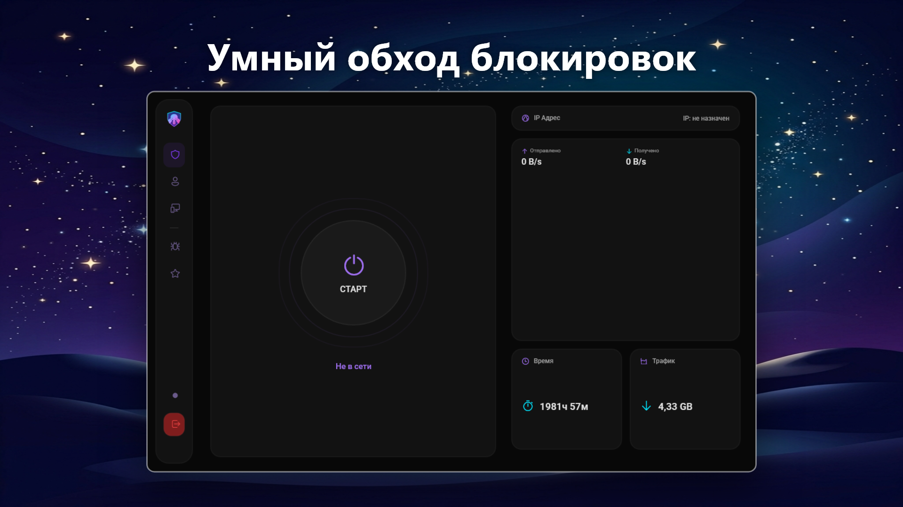
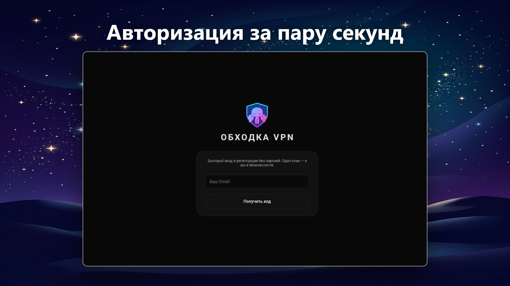

<p align="center">
  
</p>

<p align="center">
  
</p>

<div align="center">

# 🐙 Obxodka VPN Client

### _Стелс-VPN нового поколения с протоколом OBXODKA-STREAM и технологией Dual-Ray Hedging для Windows и Android._

**Абсолютная свобода в сети • Устойчивость к DPI и ТСПУ • Нулевой пинг в играх • Source-Available**

<br/>

[](https://github.com/OctoCore-Dev/obxodka/releases)
[](https://github.com/OctoCore-Dev/obxodka/actions)
[](https://play.google.com/store/apps/details?id=com.octocore.obxodka)
[](https://apps.microsoft.com/store/detail/9NZXP5WR803J)
[](https://obxodka.one/Reviews)
[](https://obxodka.one)

<br/>

[](https://dotnet.microsoft.com/)
[](https://learn.microsoft.com/dotnet/csharp/)
[](docs/ARCHITECTURE.md)
[](PRIVACY_POLICY.md)
[](TERMS_OF_SERVICE.md)
[](https://www.wintun.net/)
[](LICENSE)

</div>

<br/>

<p align="center">
  
</p>

---

## 🚀 Почему Obxodka?

Традиционные протоколы (WireGuard, OpenVPN, IPsec) используют специфические фиксированные заголовки пакетов и порты UDP, которые мгновенно распознаются и блокируются современными государственными и провайдерскими системами анализа трафика (**DPI / ТСПУ**).

**Obxodka** решает эту проблему принципиально иначе благодаря проприетарному транспортному движку **OBXODKA-STREAM**:
1. 🎭 **Полная невидимость для DPI:** Трафик инкапсулируется в стандартные дуплексные потоки **HTTP/2 поверх TLS 1.3 на порту 443** с маскировкой под Anycast CDN корпораций (Google, Yandex) и 3-этапной десинхронизацией `ClientHello`. Для систем фильтрации сессия неотличима от обычного браузерного серфинга или просмотра YouTube.
2. ⚡ **Dual-Ray Hedging (Удвоение лучей для игр и пинга):** Клиент и сервер одновременно открывают два параллельных независимых TCP-канала (`Ray 0` и `Ray 1`). Критически важные пакеты реального времени (игровой UDP и ICMP-пинги) **клонируются по обоим лучам**. Аппаратный дедупликатор `PacketDeduplicator` в скользящем окне 500 мс на лету отбрасывает дубликаты с нулевыми аллокациями памяти. Если провайдер сбрасывает пакеты на одном TCP-потоке — дубликат мгновенно долетает по второму лучу, полностью ликвидируя игровой джиттер и пакетлосс!
3. ⏱️ **Sub-Second 500ms Ping Probing:** Высокочастотное зондирование задержки каждые 500 мс обеспечивает мгновенную калибровку RTT, удерживает сотовые NAT-таблицы живыми и исключает зависание стримов.
4. 🔌 **Zero-Flicker Seamless Disconnect:** Интеллектуальный механизм отключения не сбрасывает сетевой стек Windows и не дергает системные адаптеры. При отключении VPN физический интернет не «моргает», а локальные приложения и игры продолжают работать без разрыва сокетов.

---

## ⚡ Архитектура движка Octopus Engine (OBXODKA-STREAM)

Динамическая схема прохождения сетевых пакетов через конвейер маскировки и двойной туннель:


```mermaid
flowchart LR
    subgraph Client["💻 Клиентское устройство (Windows / Android)"]
        direction TB
        App["🐙 Obxodka Client App (UI / Logic)"]
        Adapter["⚡ Wintun / VpnService (Layer 3)"]
        Router["🔀 PacketRouter & PriorityQueue\n(UDP Gaming / ICMP Cloning)"]
        Ray0["🚀 Ray 0 (HTTP/2 Stream)"]
        Ray1["🚀 Ray 1 (HTTP/2 Stream)"]
        Crypto["🔐 TLS 1.3 / AES-256-GCM / Dynamic Masking"]
        App --> Adapter --> Router
        Router --> Ray0 --> Crypto
        Router --> Ray1 --> Crypto
    end

    subgraph ISP["🛡️ Провайдер / ТСПУ (DPI-фильтрация)"]
        direction TB
        DPI{"🕵️ Глубокий анализ пакетов"}
        Pass["✅ 100% Пропуск (Трафик выглядит как обычный HTTPS/CDN)"]
        DPI ==> Pass
    end

    subgraph Server["☁️ Серверный кластер Obxodka Core Node"]
        direction TB
        Endpoint["⚡ ObxodkaTunnelEndpoint (:443)"]
        Dedup["🛡️ PacketDeduplicator (Zero-Allocation 500ms)"]
        LinuxTun["🐧 LinuxTun (tun0 L3 Interface)"]
        CleanNet["🌍 Свободный и чистый Интернет"]
        Endpoint --> Dedup --> LinuxTun --> CleanNet
    end

    Crypto ==>|Шифрованный поток Ray 0 + Ray 1| DPI
    Pass ==>|OBXODKA-STREAM Multiplexing| Endpoint

    classDef clientStyle fill:#1a1c23,stroke:#00e5ff,stroke-width:2px,color:#fff;
    classDef dpiStyle fill:#2d1b36,stroke:#ff007f,stroke-width:2px,color:#fff;
    classDef serverStyle fill:#13271f,stroke:#00ff88,stroke-width:2px,color:#fff;

    class Client clientStyle;
    class ISP dpiStyle;
    class Server serverStyle;
```

---

## 🔐 Протокол аутентификации mTLS Zero-Trust

Никаких статических паролей и общих ключей: каждое устройство проходит динамическую взаимную верификацию сертификата:


```mermaid
sequenceDiagram
    autonumber
    actor User as 👤 Пользователь
    participant Client as 🐙 Obxodka App
    participant Auth as 🔑 Auth Server (API)
    participant Gateway as ⚡ Obxodka Node (:443)

    User->>Client: Авторизация в аккаунт
    Client->>Auth: Запрос динамического сессионного сертификата
    Auth-->>Client: Выдача зашифрованного .pfx сертификата
    Client->>Gateway: Установка TLS 1.3 с десинхронизацией ClientHello
    Gateway-->>Client: Взаимное подтверждение подлинности (mTLS Handshake OK)
    Client->>Gateway: Инициализация OBXODKA-STREAM (Ray 0 + Ray 1)
    Note over Client,Gateway: Dual-Ray Hedging: клонирование UDP/ICMP и защита от потерь
```

---

## 📊 Сравнение технологий и протоколов

| Протокол / Технология | Устойчивость к DPI / ТСПУ | Скорость и игровой пинг | Шифрование сессии | Мультиплексирование | Защита от блокировок |
| :--- | :---: | :---: | :---: | :---: | :---: |
| 🐙 **Obxodka (OBXODKA-STREAM)** | 🟢 **100% (Не детектируется)** | ⚡ **< 1ms задержка (Dual-Ray Hedging)** | 🔒 **TLS 1.3 + AES-256-GCM** | 🚀 **Dual-Ray Duplex HTTP/2** | 🛡️ **Максимальная** |
| 🛡️ **WireGuard** | 🔴 **0% (Блокируется по UDP)** | ⚡ **Высокая (но уязвим к дропу)** | 🔒 ChaCha20-Poly1305 | ❌ Нет | ❌ Блокируется |
| 🔒 **OpenVPN** | 🔴 **10% (Легко детектируется)** | 🐢 **Низкая (TAP Overhead)** | 🔒 TLS / AES-CBC | ❌ Нет | ❌ Блокируется |
| 👥 **Shadowsocks / VLESS** | 🟡 **60% (Частично блокируется)** | ⚡ **Высокая** | 🔒 AEAD / TLS | ⚠️ Ограничено | ⚠️ Частичная |

---

## 🛡️ Интеллектуальный защитный контур (Smart Shield & Anti-Spyware Engine)

В **Obxodka** интегрирована передовая аппаратная система защиты от шпионских SDK, трекеров телеметрии и детекции туннеля на **Windows** и **Android**:

- ⚡ **Аппаратный L3 DNS Sinkhole (Windows & Android):** Встроенный в драйвер Wintun и TUN-ядро перехватчик сетевых запросов. Все попытки фоновой телеметрии (`AppMetrica`, `Yandex Metrika`, `VK Stats`, `Mail.ru`, аналитика Сбера, Госуслуг, трекеры `AppsFlyer` / `Adjust`) перехватываются на L3-уровне и за **`0.05 мс` гасятся ответом `0.0.0.0`**. Шпионский пакет физически не покидает оперативную память устройства.
- 🚀 **Happy Eyeballs & Auto-Best-Node:** Параллельное неблокирующее зондирование серверов кластера при подключении. Клиент автоматически выбирает узел с минимальным RTT и наименьшей нагрузкой, исключая таймауты и зависания.
- 🔀 **Адаптивный обход DPI (Multi-Stage TLS Splitting):** Динамическое расщепление первого сегмента TLS ClientHello на 1–5 байт с паузой 15–35 мс и фрагментацией тела. Системы ТСПУ и DPI не способны восстановить сигнатуру рукопожатия и пропускают трафик без замедлений.
- 🔄 **Zero-Handoff Seamless Switching:** Бесшовное переключение серверов и сетевой роуминг (Wi-Fi ↔ LTE) без сброса TCP-соединений, потери пакетов или прыжков интернет-трафика.
- 🔌 **Zero-Flicker Disconnect:** Бесшовное отключение туннеля без сброса базового сетевого адаптера ОС — интернет не мигает, фоновые закачки и локальные соединения не обрываются.
- 🛡️ **Защита от утечек DNS (NRPT & Auto-Heal):** Принудительная изоляция через таблицу политик разрешения имен Windows (NRPT), сброс кэша резолвера и автоматическое восстановление поврежденного физического DNS при аварийном завершении других VPN.
- 🔋 **Адаптивный Mobile NAT Keep-Alive (Android):** Умный таймер поддержания сотовых NAT-таблиц (25 сек в покое / 3 сек при активности), снижающий нагрузку на радиомодуль и экономящий до 90% заряда батареи.
- 🎭 **Smart App Cloaking (Android):** Автоматическая изоляция отечественных банков, Госуслуг, такси и маркетплейсов (`AddDisallowedApplication`). Операционная система Android рапортует приложениям: **`TRANSPORT_VPN: FALSE`** — банки не блокируют переводы и работают на максимальной скорости сотового оператора без капчи.
- 🔒 **Zero-Leak & Hardware Kill-Switch (Windows & Android):** Принудительная блокировка утечек IPv6 (`fd00::/8`), изоляция WebRTC/STUN портов (`3478` / `5349`) и аппаратная блокировка пакетов при разрывах связи (`SetBlocking(true)` на Android и охватывающие префиксы Wintun с метрикой 1 на Windows).

---

## 🎨 Галерея интерфейса

<p align="center">
  
  
</p>
<p align="center">
  
  
</p>

---

## 🗺️ Дорожная карта развития (Roadmap 2026)

- [x] 🚀 **Релиз клиента для Android** в [Google Play Store](https://play.google.com/store/apps/details?id=com.octocore.obxodka)
- [x] 🪟 **Релиз клиента для Windows 10/11** в [Microsoft Store](https://apps.microsoft.com/store/detail/9NZXP5WR803J)
- [x] ⚡ **Движок Octopus:** Wintun Layer 3 + OBXODKA-STREAM (HTTP/2 duplex)
- [x] 🎮 **Dual-Ray Hedging:** Удвоение игрового трафика и пингов с zero-allocation дедупликацией
- [x] 🔌 **Zero-Flicker Disconnect:** Бесшовное отключение туннеля без моргания сетевого стека Windows
- [x] 🔄 **Автоматическая синхронизация отзывов:** Google Play + Microsoft Store на сайте [obxodka.one/Reviews](https://obxodka.one/Reviews)
- [x] 🛡️ **CI/CD Авто-деплой:** непрерывная сборка и публикация в магазины через GitHub Actions
- [x] 🛑 **Встроенный AdBlock & Anti-Phishing фильтр на уровне DNS**
- [ ] 🍎 **Разработка клиентов под iOS и macOS**

---

## ⚖️ Юридическая информация и конфиденциальность (Legal & Privacy)

Проект Obxodka придерживается прозрачных правовых стандартов и строгой защиты конфиденциальности:

* 🛡️ **[Политика конфиденциальности и Zero-Log (Privacy Policy)](PRIVACY_POLICY.md)** — полное описание гарантии отсутствия логов (No-Logs), декларация `VpnService` для Google Play и соответствие GDPR / 152-ФЗ.
* 📜 **[Пользовательское соглашение и EULA (Terms of Service)](TERMS_OF_SERVICE.md)** — правила допустимого использования сервиса (AUP), ограничение ответственности и отказ от гарантий.
* 🔒 **[Политика безопасности и криптография](.github/SECURITY.md)** — криптографическая спецификация и правила ответственного раскрытия уязвимостей.

---

## ❓ Часто задаваемые вопросы (FAQ)

<details>
<summary><b>🔍 Почему Obxodka не блокируется, когда блокируют другие VPN?</b></summary>
<br>

Большинство обычных VPN используют протоколы с фиксированными сигнатурами (WireGuard handshake, OpenVPN TLS handshake). Системы DPI легко видят такие пакеты и сбрасывают соединение. **Obxodka** инкапсулирует трафик в проприетарные HTTP/2 потоки поверх TLS 1.3 на 443 порту с динамической обфускацией и разделением ClientHello — для любого провайдера это выглядит как обычный защищенный просмотр веб-сайтов крупных IT-корпораций.

</details>

<details>
<summary><b>🎮 Как Dual-Ray Hedging решает проблему пинга и потерь пакетов в онлайн-играх?</b></summary>
<br>

В обычных VPN трафик идет по одному соединению. Если провайдер кратковременно теряет пакет (джиттер/дроп на узле ТСПУ), игра зависает или телепортирует персонажа. В Obxodka технология **Dual-Ray Hedging** клонирует каждый игровой UDP-пакет и ICMP-пинг в два независимых физических TCP-луча (`Ray 0` и `Ray 1`). Сервер и клиент принимают тот пакет, который пришел быстрее, а дубликат мгновенно отбрасывается `PacketDeduplicator`. В результате пинг остается идеально ровным даже при нестабильном интернете.

</details>

<details>
<summary><b>🛡️ Ведёт ли Obxodka логи посещений (Logs)?</b></summary>
<br>

**Категорически нет.** Вся архитектура построена по принципу Zero-Log. Серверы не хранят историю посещенных сайтов, IP-адреса назначения или DNS-запросы. Трафик проходит через оперативную память в зашифрованном виде и мгновенно уничтожается. Подробнее читайте в [Политике конфиденциальности](PRIVACY_POLICY.md).

</details>

<details>
<summary><b>💻 Как собрать проект из исходников самостоятельно?</b></summary>
<br>

```powershell
# 1. Клонирование репозитория
git clone https://github.com/OctoCore-Dev/obxodka.git
cd obxodka

# 2. Установка рабочих нагрузок .NET MAUI
dotnet workload install maui-windows maui-android

# 3. Сборка клиента под Windows
dotnet build src/apps/obxodka.Maui/obxodka.Maui.csproj -f net10.0-windows10.0.19041.0 -c Release

# 4. Запуск модульных тестов
dotnet test tests/obxodka.Client.Tests/obxodka.Client.Tests.csproj
```

</details>

---

## 🤝 Сообщество и контакты

- 🌐 **Официальный сайт:** [obxodka.one](https://obxodka.one)
- 📐 **Архитектура и спецификация:** [docs/ARCHITECTURE.md](docs/ARCHITECTURE.md)
- 🔧 **Диагностика и устранение неполадок:** [docs/TROUBLESHOOTING.md](docs/TROUBLESHOOTING.md)
- 🔒 **Политика безопасности и криптография:** [.github/SECURITY.md](.github/SECURITY.md)
- 🛡️ **Политика конфиденциальности (No-Logs):** [PRIVACY_POLICY.md](PRIVACY_POLICY.md)
- 📜 **Условия использования (ToS / EULA):** [TERMS_OF_SERVICE.md](TERMS_OF_SERVICE.md)
- 💬 **Форум и обсуждения:** [GitHub Discussions](https://github.com/OctoCore-Dev/obxodka/discussions)
- 🐛 **Сообщить об ошибке:** [GitHub Issues](https://github.com/OctoCore-Dev/obxodka/issues)
- 📧 **Контакты и поддержка:** [contact@octocore.dev](mailto:contact@octocore.dev)
- 📜 **Кодекс поведения:** [.github/CODE_OF_CONDUCT.md](.github/CODE_OF_CONDUCT.md)

---

<p align="center">
  <sub>Разработано с ❤️ командой <a href="https://github.com/OctoCore-Dev">OctoCore</a>. Лицензия <a href="LICENSE">Source-Available (OctoCore)</a>.</sub>
</p>
